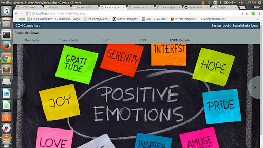
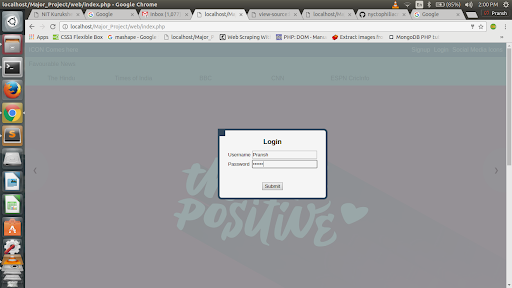
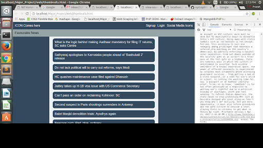

# Proton News

## Introduction
Through this project, we want to create a web portal that displays news from several news
publishing websites by filtering content with negative tones. The web portal will have several
features such as text-to-speech conversion, &quot;Short News&quot; etc.

## Scope
Consumption of news coverage of violent events is associated with aggressive behaviour,
thoughts and angry feelings and is known to lead to increase in nightmares and sleep
disturbances. Overall, the above factors can result in increased anxiety, stress levels and
increased negative perception among people. While the importance of news and its power to
educate the masses is unquestionable, it may be beneficial to the readers if disturbing content
such as description of violence is filtered.
The intention of our project is simply to filter the negativity out of digital news without
restricting information in any way. With the use of natural language processing techniques
and algorithms, we intend to remove news posts (from several news sites such as TOI, Indian
Express etc) that have a critically negative tone and present news on a web portal from these
sources. This can be especially useful for children. Also this filtering can be applied to
content sharing platforms such as YouTube, Facebook etc. in future.

## Environment
1. Language used: Javascript, HTML, CSS, JSP
2. Database: MongoDB (maybe used), MySQL
3. Netbeans IDE, Atom (For development)
4. Watson Tone Analyzer
5. No hardware requirements

### Screenshots

|  |  |
| --- | --- |
| | |
| | |

## Issues

